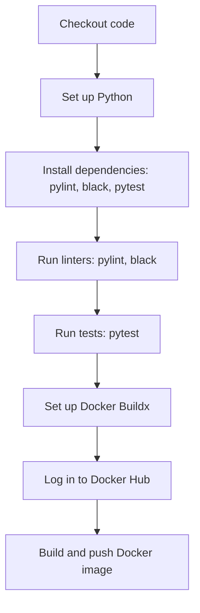
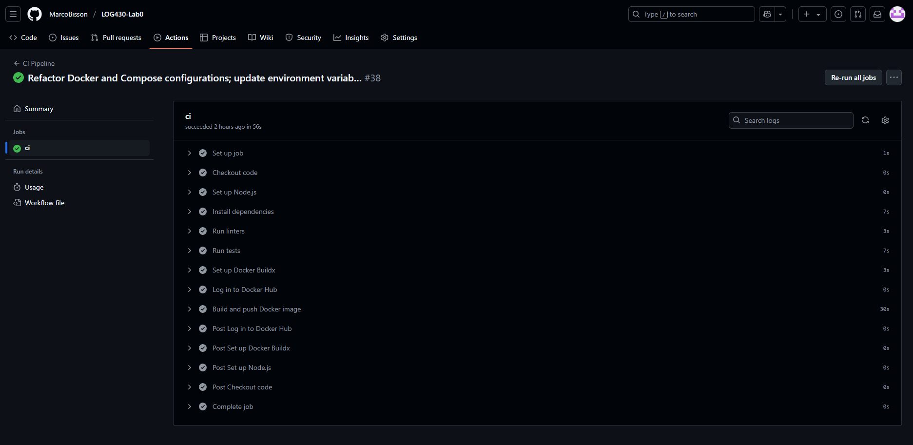

# LOG430 - Laboratoire 0 : Infrastructure (Docker, CI/CD, Version Control)

## Description
 
Ce projet est une application minimale (ex : affichage "Hello, World!", addition, soustraction, multiplication et division), développée en Python, testée automatiquement, conteneurisée avec Docker et intégrée dans une pipeline CI/CD (GitHub Actions). Le but de cette application est de comprendre comment conteneurisée avec Docker un projet ainsi que d'implémenté un bon CI/CD de base qui exécute des linter, les tests unitaires, le build docker du projet et push le projet sur Docker Hub.

## Objectifs

- Structurer un dépôt de projet sur GitHub
- Mettre en place des tests unitaires automatisés
- Conteneuriser l’application avec Docker
- Automatiser lint, tests, build et push (sur Docker Hub) avec une pipeline CI/CD

## Structure du projet

```
LOG430-Lab0/
├── app/                  # Code source principal Python
│   ├── main.py           # Code exécutant les fonctions de l'API
|   └── api.py            # Application minimaliste (Hello World et opération mathématique de base)
├── tests/
|   └── api_test.py       # Code tests unitaires pour l'API
├── .github/
│   └── workflows/
│       └── ci.yml        # Pipeline GitHub Actions (lint, test, build, push)
├── screenshots/          # Screenshots
├── Dockerfile            # Image Docker de l’application
├── docker-compose.yml    # Orchestration multi-conteneurs
├── .dockerignore         # Fichiers à ignorer lors du build Docker
├── .gitignore            # Fichiers à ignorer par Git
└── README.md             # Documentation sur le projet
```

## Instructions d’exécution

### 1. Cloner le projet

```bash
git clone https://github.com/MarcoBisson/LOG430-Lab0.git
cd LOG430-Lab0
```

### 2. Exécuter l’application en local (hors conteneur)
Installer Python:
```bash
sudo apt install python3 python3-pip
```

Installer les dépendances :
```bash
pip install pytest black pylint
```
ou
```bash
sudo apt install pytest black pylint
```

Lancer l’application :
```bash
python app/main.py
```

### 3. Lancer les tests unitaires (pytests)

```bash
pytest tests/
```

### 4. Exécuter avec Docker (sans Docker Compose)

Construire l’image :
```bash
docker build -t log430-lab0 .
```

Lancer le conteneur :
```bash
docker run --rm log430-lab0
```

### 5. Exécuter avec Docker (avec Docker Compose)

```bash
docker-compose up --build
```

### 6. Pipeline CI/CD

La pipeline CI/CD (lint, tests, build et push) s'exécute automatiquement à chaque push, pull request ou déclenchement manuel. Voici le diagramme Mermaid détaillant chaque étape de la pipeline :

<details>
<summary>Afficher le graphique des steps du CI/CD avec Mermaid</summary>


</details>

#### Exemple de résultat pipeline



## Ressources

- [Docker – Getting Started](https://docs.docker.com/get-started/)
- [GitHub Actions – Quickstart](https://docs.github.com/en/actions/quickstart)
- [Guide des tests unitaires Python (pytest)](https://docs.pytest.org/en/stable/)

