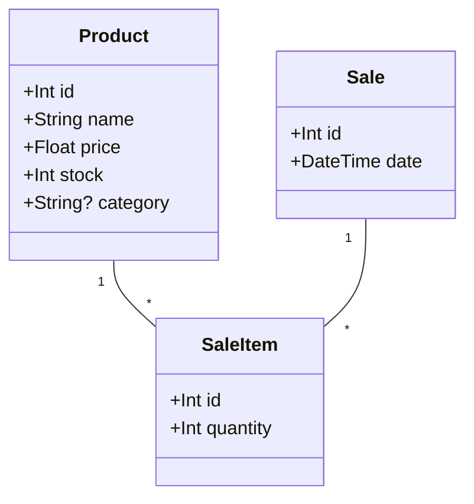

```mermaid
classDiagram
    class Product {
        +Int id
        +String name
        +Float price
        +Int stock
        +String? category
    }
    class Sale {
        +Int id
        +DateTime date
    }
    class SaleItem {
        +Int id
        +Int quantity
    }
    Product "1" -- "*" SaleItem
    Sale "1" -- "*" SaleItem
```