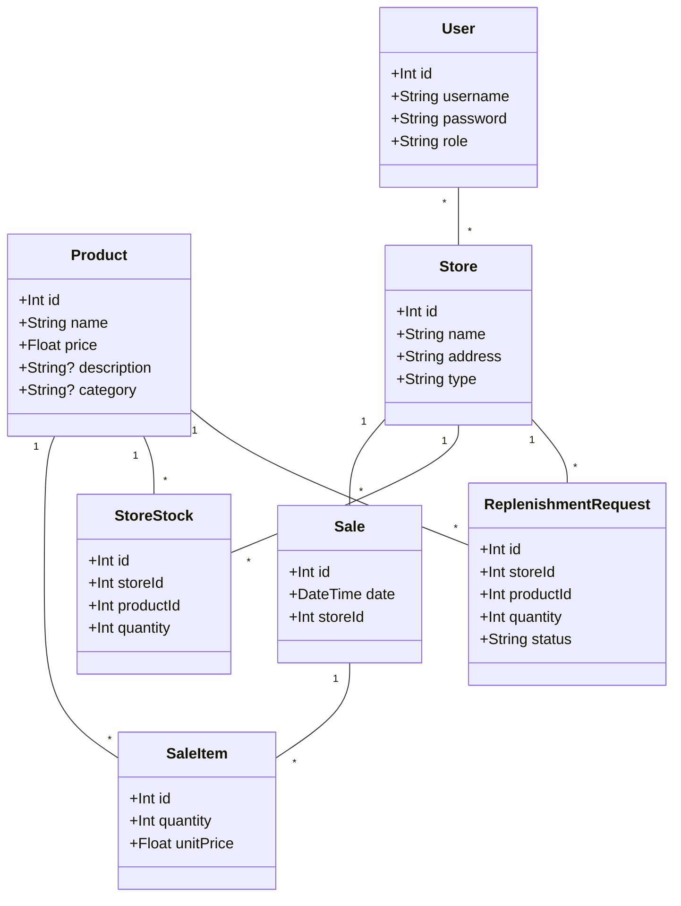

```mermaid
classDiagram
    class Product {
        +Int id
        +String name
        +Float price
        +String? description
        +String? category
    }
    class Store {
        +Int id
        +String name
        +String address
        +String type
    }
    class StoreStock {
        +Int id
        +Int storeId
        +Int productId
        +Int quantity
    }
    class Sale {
        +Int id
        +DateTime date
        +Int storeId
    }
    class SaleItem {
        +Int id
        +Int quantity
        +Float unitPrice
    }
    class User {
        +Int id
        +String username
        +String password
        +String role
    }
    class ReplenishmentRequest {
        +Int id
        +Int storeId
        +Int productId
        +Int quantity
        +String status
    }
    
    Product "1" -- "*" SaleItem
    Sale "1" -- "*" SaleItem
    Store "1" -- "*" Sale
    Store "1" -- "*" StoreStock
    Product "1" -- "*" StoreStock
    Store "1" -- "*" ReplenishmentRequest
    Product "1" -- "*" ReplenishmentRequest
    User "*" -- "*" Store
```
