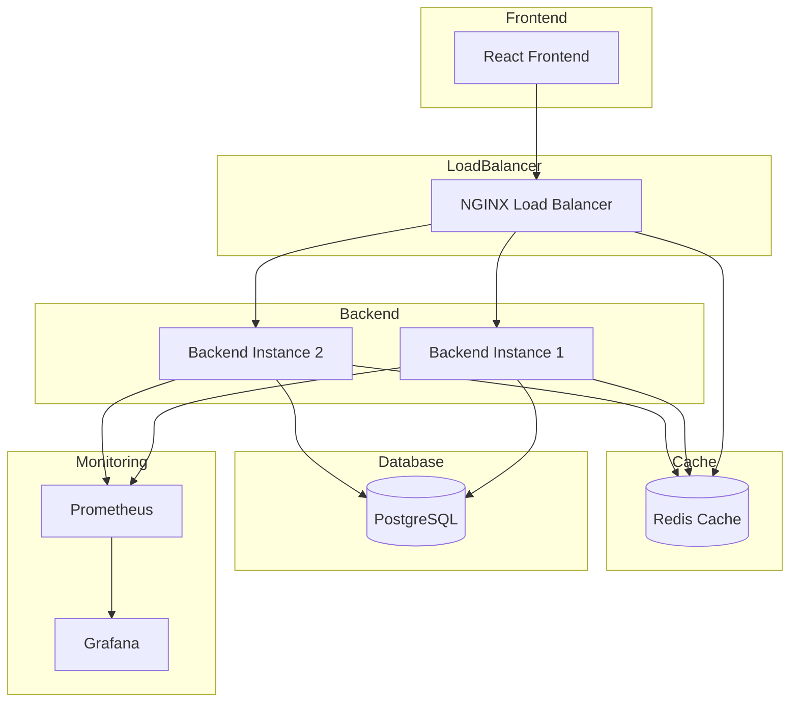

```mermaid
flowchart TB
    subgraph Frontend
      ReactApp[React Frontend]
    end
    subgraph LoadBalancer
      NGINX[NGINX Load Balancer]
    end
    subgraph Backend
      API1[Backend Instance 1]
      API2[Backend Instance 2]
    end
    subgraph Cache
      Redis[(Redis Cache)]
    end
    subgraph Database
      DB[(PostgreSQL)]
    end
    subgraph Monitoring
      Prometheus[Prometheus]
      Grafana[Grafana]
    end
    
    ReactApp --> NGINX
    NGINX --> API1
    NGINX --> API2
    NGINX --> Redis
    API1 --> DB
    API2 --> DB
    API1 --> Redis
    API2 --> Redis
    API1 --> Prometheus
    API2 --> Prometheus
    Prometheus --> Grafana
```
