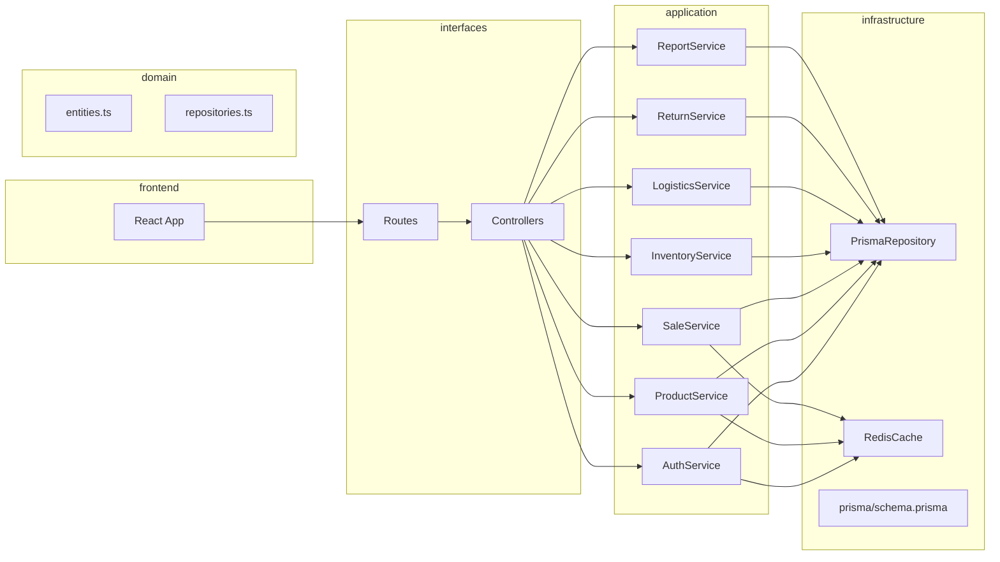

```mermaid
flowchart LR
    subgraph frontend
      ReactApp[React App]
    end
    subgraph interfaces
      Controllers[Controllers]
      Routes[Routes]
    end
    subgraph application
      AuthService
      ProductService
      SaleService
      InventoryService
      LogisticsService
      ReturnService
      ReportService
    end
    subgraph domain
      entities.ts
      repositories.ts
    end
    subgraph infrastructure
      PrismaRepository
      RedisCache
      prisma/schema.prisma
    end

    ReactApp --> Routes
    Routes --> Controllers
    Controllers --> AuthService
    Controllers --> ProductService
    Controllers --> SaleService
    Controllers --> InventoryService
    Controllers --> LogisticsService
    Controllers --> ReturnService
    Controllers --> ReportService
    AuthService --> PrismaRepository
    ProductService --> PrismaRepository
    SaleService --> PrismaRepository
    InventoryService --> PrismaRepository
    LogisticsService --> PrismaRepository
    ReturnService --> PrismaRepository
    ReportService --> PrismaRepository
    AuthService --> RedisCache
    ProductService --> RedisCache
    SaleService --> RedisCache
```
