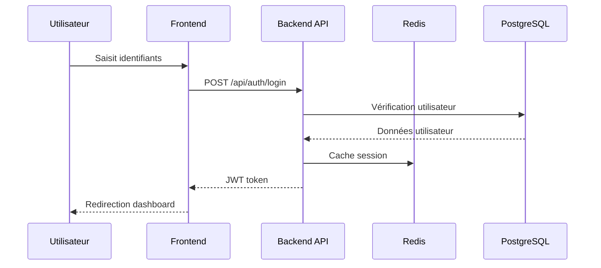
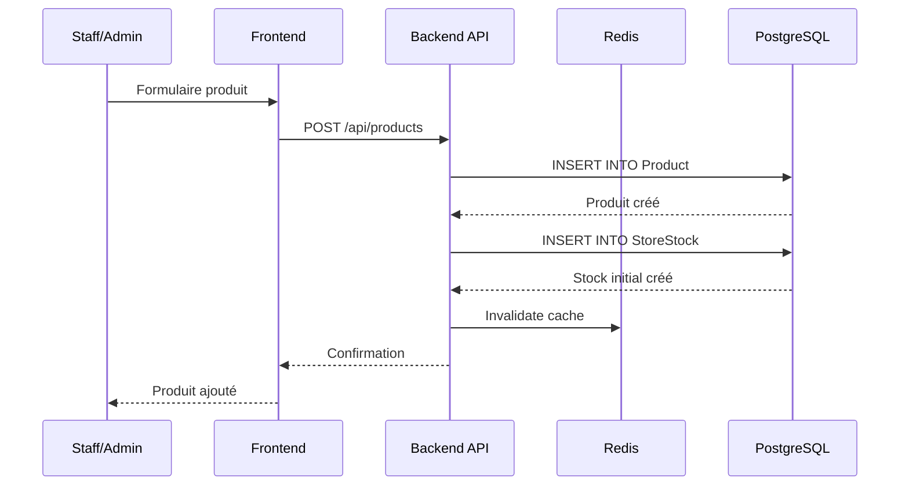
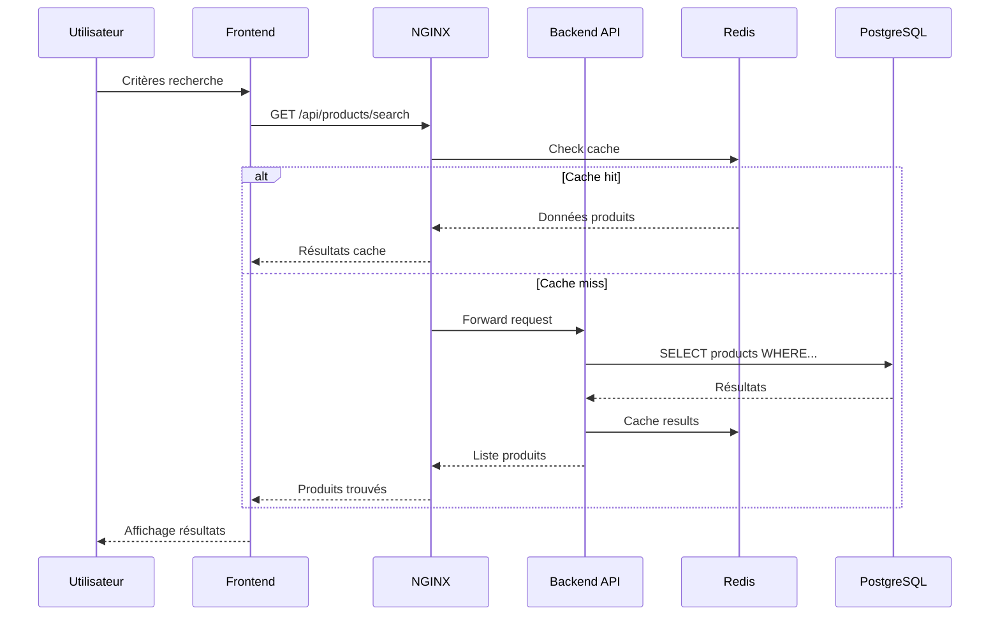
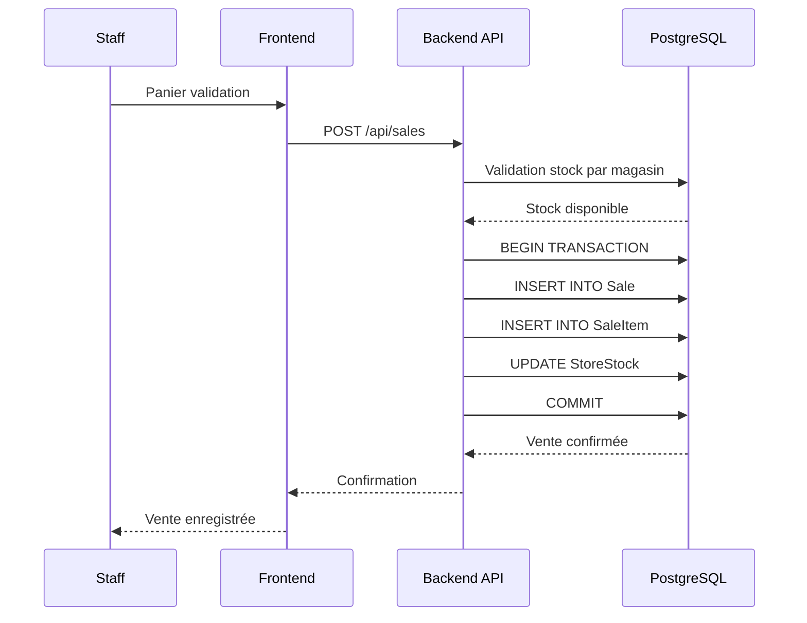
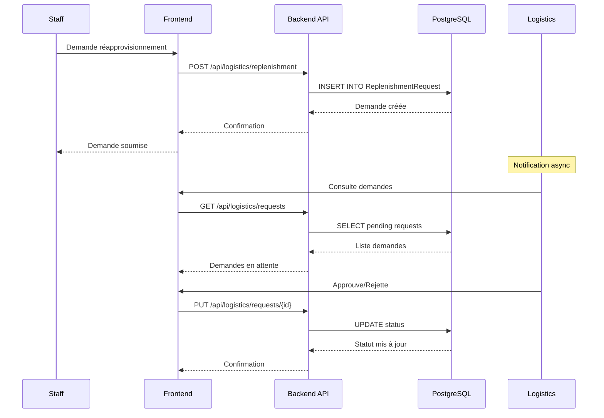
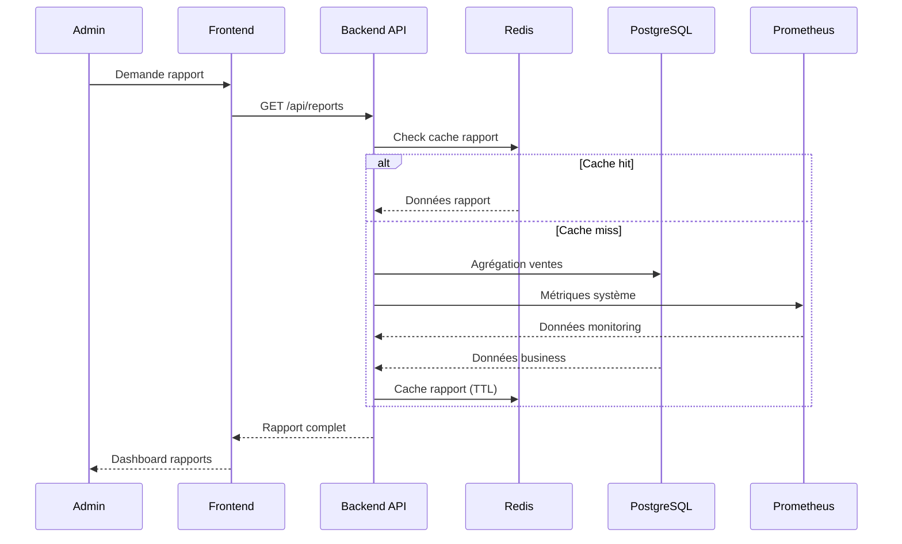

# Diagrammes de séquences

## Authentification

```mermaid
sequenceDiagram
    participant U as Utilisateur
    participant F as Frontend
    participant API as Backend API
    participant R as Redis
    participant DB as PostgreSQL

    U->>F: Saisit identifiants
    F->>API: POST /api/auth/login
    API->>DB: Vérification utilisateur
    DB-->>API: Données utilisateur
    API->>R: Cache session
    API-->>F: JWT token
    F-->>U: Redirection dashboard
```

## Ajouter un produit

```mermaid
sequenceDiagram
    participant U as Staff/Admin
    participant F as Frontend
    participant API as Backend API
    participant R as Redis
    participant DB as PostgreSQL

    U->>F: Formulaire produit
    F->>API: POST /api/products
    API->>DB: INSERT INTO Product
    DB-->>API: Produit créé
    API->>DB: INSERT INTO StoreStock
    DB-->>API: Stock initial créé
    API->>R: Invalidate cache
    API-->>F: Confirmation
    F-->>U: Produit ajouté
```

## Rechercher un produit

```mermaid
sequenceDiagram
    participant U as Utilisateur
    participant F as Frontend
    participant N as NGINX
    participant API as Backend API
    participant R as Redis
    participant DB as PostgreSQL

    U->>F: Critères recherche
    F->>N: GET /api/products/search
    N->>R: Check cache
    alt Cache hit
        R-->>N: Données produits
        N-->>F: Résultats cache
    else Cache miss
        N->>API: Forward request
        API->>DB: SELECT products WHERE...
        DB-->>API: Résultats
        API->>R: Cache results
        API-->>N: Liste produits
        N-->>F: Produits trouvés
    end
    F-->>U: Affichage résultats
```

## Enregistrer une vente

```mermaid
sequenceDiagram
    participant U as Staff
    participant F as Frontend
    participant API as Backend API
    participant DB as PostgreSQL

    U->>F: Panier validation
    F->>API: POST /api/sales
    API->>DB: Validation stock par magasin
    DB-->>API: Stock disponible
    API->>DB: BEGIN TRANSACTION
    API->>DB: INSERT INTO Sale
    API->>DB: INSERT INTO SaleItem
    API->>DB: UPDATE StoreStock
    API->>DB: COMMIT
    DB-->>API: Vente confirmée
    API-->>F: Confirmation
    F-->>U: Vente enregistrée
```

## Demande de réapprovisionnement

```mermaid
sequenceDiagram
    participant S as Staff
    participant F as Frontend
    participant API as Backend API
    participant DB as PostgreSQL
    participant L as Logistics

    S->>F: Demande réapprovisionnement
    F->>API: POST /api/logistics/replenishment
    API->>DB: INSERT INTO ReplenishmentRequest
    DB-->>API: Demande créée
    API-->>F: Confirmation
    F-->>S: Demande soumise
    
    Note over L: Notification async
    L->>F: Consulte demandes
    F->>API: GET /api/logistics/requests
    API->>DB: SELECT pending requests
    DB-->>API: Liste demandes
    API-->>F: Demandes en attente
    
    L->>F: Approuve/Rejette
    F->>API: PUT /api/logistics/requests/{id}
    API->>DB: UPDATE status
    DB-->>API: Statut mis à jour
    API-->>F: Confirmation
```

## Consulter les rapports

```mermaid
sequenceDiagram
    participant A as Admin
    participant F as Frontend
    participant API as Backend API
    participant R as Redis
    participant DB as PostgreSQL
    participant P as Prometheus

    A->>F: Demande rapport
    F->>API: GET /api/reports
    API->>R: Check cache rapport
    alt Cache hit
        R-->>API: Données rapport
    else Cache miss
        API->>DB: Agrégation ventes
        API->>P: Métriques système
        P-->>API: Données monitoring
        DB-->>API: Données business
        API->>R: Cache rapport (TTL)
    end
    API-->>F: Rapport complet
    F-->>A: Dashboard rapports
```
