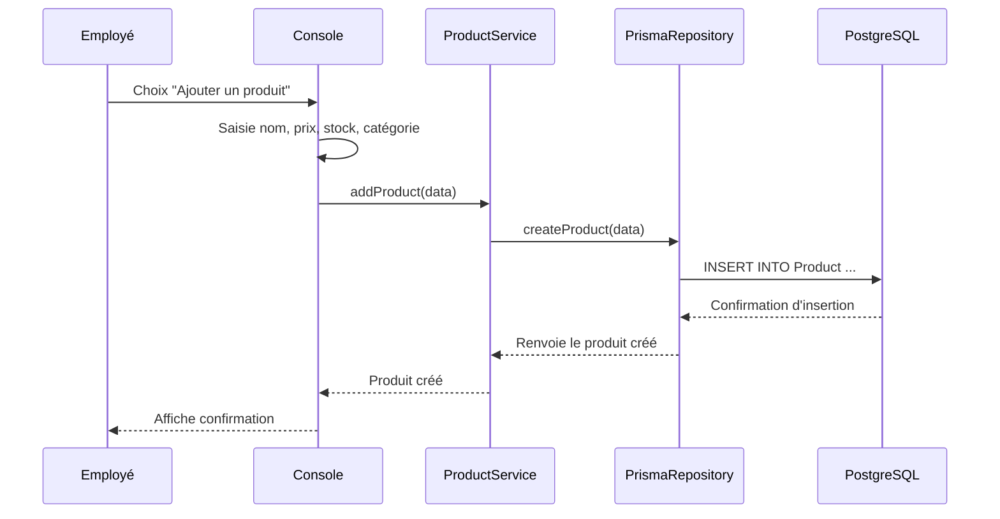
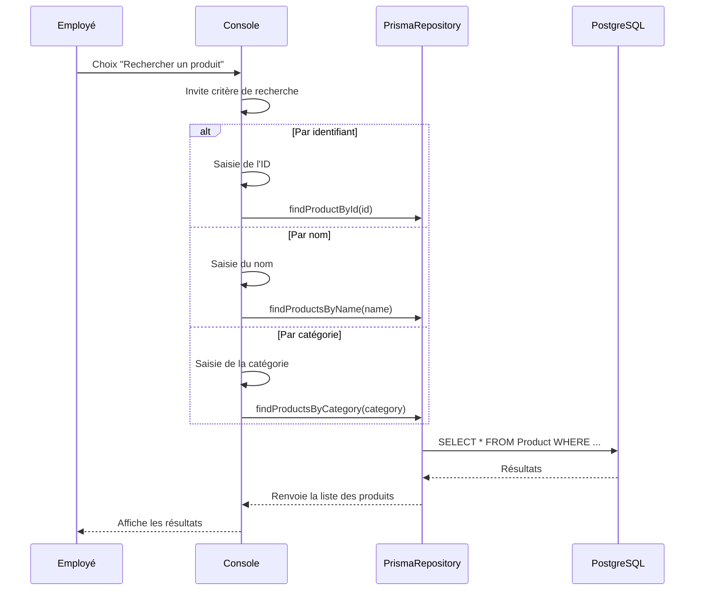
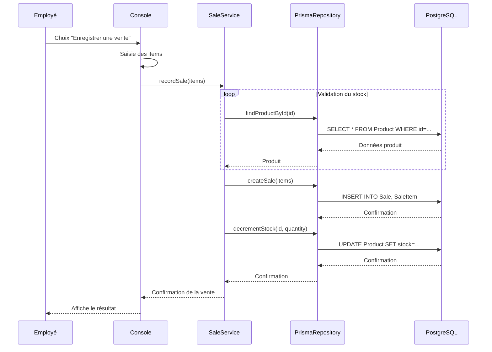
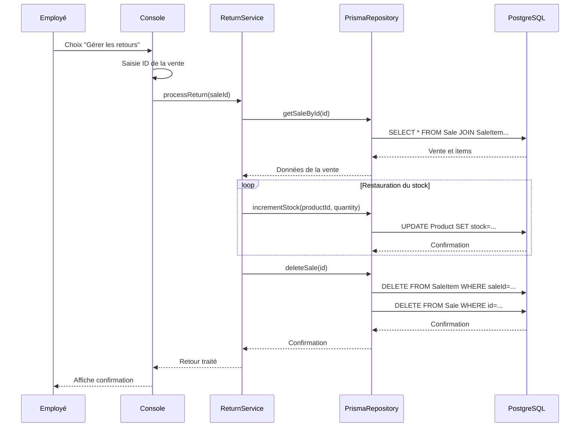
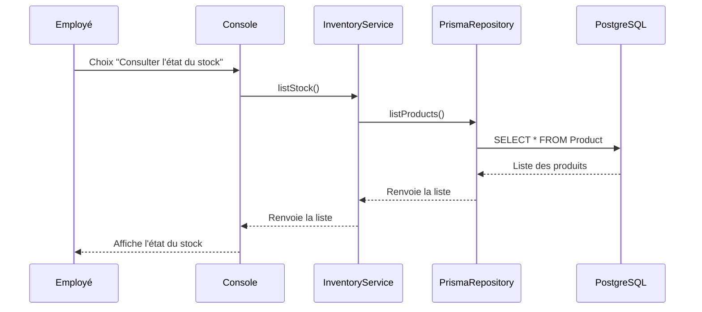

# Diagrammes de séquences

## Ajouter un produit

```mermaid
sequenceDiagram
    participant U as Employé
    participant C as Console
    participant P as ProductService
    participant R as PrismaRepository
    participant DB as PostgreSQL

    U->>C: Choix "Ajouter un produit"
    C->>C: Saisie nom, prix, stock, catégorie
    C->>P: addProduct(data)
    P->>R: createProduct(data)
    R->>DB: INSERT INTO Product ...
    DB-->>R: Confirmation d'insertion
    R-->>P: Renvoie le produit créé
    P-->>C: Produit créé
    C-->>U: Affiche confirmation
```

## Rechercher un produit

```mermaid
sequenceDiagram
    participant U as Employé
    participant C as Console
    participant R as PrismaRepository
    participant DB as PostgreSQL

    U->>C: Choix "Rechercher un produit"
    C->>C: Invite critère de recherche
    alt Par identifiant
        C->>C: Saisie de l'ID
        C->>R: findProductById(id)
    else Par nom
        C->>C: Saisie du nom
        C->>R: findProductsByName(name)
    else Par catégorie
        C->>C: Saisie de la catégorie
        C->>R: findProductsByCategory(category)
    end
    R->>DB: SELECT * FROM Product WHERE ...
    DB-->>R: Résultats
    R-->>C: Renvoie la liste des produits
    C-->>U: Affiche les résultats
```

## Enregistrer une vente

```mermaid
sequenceDiagram
    participant U as Employé
    participant C as Console
    participant S as SaleService
    participant R as PrismaRepository
    participant DB as PostgreSQL

    U->>C: Choix "Enregistrer une vente"
    C->>C: Saisie des items
    C->>S: recordSale(items)
    loop Validation du stock
        S->>R: findProductById(id)
        R->>DB: SELECT * FROM Product WHERE id=...
        DB-->>R: Données produit
        R-->>S: Produit
    end
    S->>R: createSale(items)
    R->>DB: INSERT INTO Sale, SaleItem
    DB-->>R: Confirmation
    S->>R: decrementStock(id, quantity)
    R->>DB: UPDATE Product SET stock=...
    DB-->>R: Confirmation
    R-->>S: Confirmation
    S-->>C: Confirmation de la vente
    C-->>U: Affiche le résultat
```

## Gérer les retours

```mermaid
sequenceDiagram
    participant U as Employé
    participant C as Console
    participant RS as ReturnService
    participant R as PrismaRepository
    participant DB as PostgreSQL

    U->>C: Choix "Gérer les retours"
    C->>C: Saisie ID de la vente
    C->>RS: processReturn(saleId)
    RS->>R: getSaleById(id)
    R->>DB: SELECT * FROM Sale JOIN SaleItem...
    DB-->>R: Vente et items
    R-->>RS: Données de la vente
    loop Restauration du stock
        RS->>R: incrementStock(productId, quantity)
        R->>DB: UPDATE Product SET stock=...
        DB-->>R: Confirmation
    end
    RS->>R: deleteSale(id)
    R->>DB: DELETE FROM SaleItem WHERE saleId=...
    R->>DB: DELETE FROM Sale WHERE id=...
    DB-->>R: Confirmation
    R-->>RS: Confirmation
    RS-->>C: Retour traité
    C-->>U: Affiche confirmation
```

## Consulter l'état du stock

```mermaid
sequenceDiagram
    participant U as Employé
    participant C as Console
    participant IS as InventoryService
    participant R as PrismaRepository
    participant DB as PostgreSQL

    U->>C: Choix "Consulter l'état du stock"
    C->>IS: listStock()
    IS->>R: listProducts()
    R->>DB: SELECT * FROM Product
    DB-->>R: Liste des produits
    R-->>IS: Renvoie la liste
    IS-->>C: Renvoie la liste
    C-->>U: Affiche l'état du stock
```