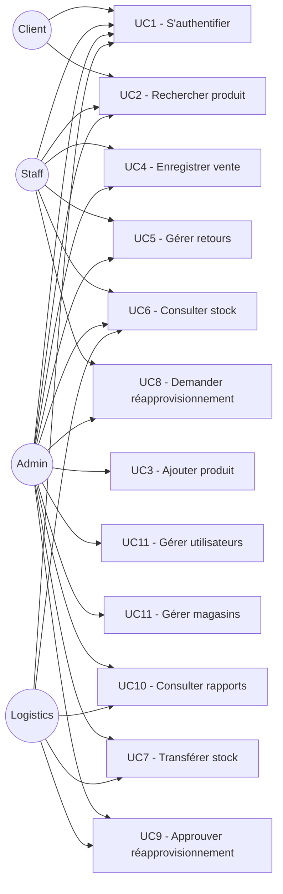

```mermaid
flowchart LR
    %% Acteurs
    Client((Client))
    Staff((Staff))
    Admin((Admin))
    Logistics((Logistics))
    
    %% Authentification
    Auth[" UC1 - S'authentifier"]
    
    %% Gestion Produits
    SearchProduct[" UC2 - Rechercher produit"]
    AddProduct[" UC3 - Ajouter produit"]
    
    %% Ventes
    RecordSale[" UC4 - Enregistrer vente"]
    ProcessReturn[" UC5 - Gérer retours"]
    
    %% Stock et Inventaire
    ViewStock[" UC6 - Consulter stock"]
    TransferStock[" UC7 - Transférer stock"]
    RequestReplenish[" UC8 - Demander réapprovisionnement"]
    ApproveReplenish[" UC9 - Approuver réapprovisionnement"]
    
    %% Administration
    ViewReports[" UC10 - Consulter rapports"]
    ManageUsers[" UC11 - Gérer utilisateurs"]
    ManageStores[" UC11 - Gérer magasins"]

    %% Relations Client
    Client --> Auth
    Client --> SearchProduct
    
    %% Relations Staff
    Staff --> Auth
    Staff --> SearchProduct
    Staff --> RecordSale
    Staff --> ProcessReturn
    Staff --> ViewStock
    Staff --> RequestReplenish
    
    %% Relations Admin
    Admin --> Auth
    Admin --> SearchProduct
    Admin --> AddProduct
    Admin --> RecordSale
    Admin --> ProcessReturn
    Admin --> ViewStock
    Admin --> RequestReplenish
    Admin --> ManageUsers
    Admin --> ManageStores
    Admin --> ViewReports
    Admin --> TransferStock
    Admin --> ApproveReplenish
    
    %% Relations Logistics
    Logistics --> Auth
    Logistics --> ViewStock
    Logistics --> TransferStock
    Logistics --> ApproveReplenish
    Logistics --> ViewReports
```
