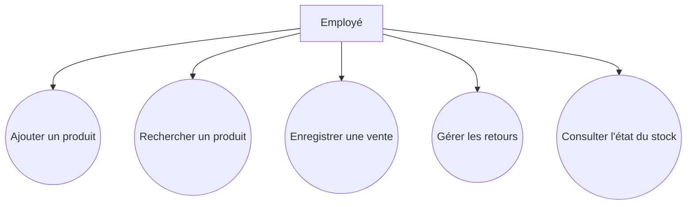

```mermaid
flowchart TD
  E[Employé]

  E --> UC1(("Ajouter un produit"))
  E --> UC2(("Rechercher un produit"))
  E --> UC3(("Enregistrer une vente"))
  E --> UC4(("Gérer les retours"))
  E --> UC5(("Consulter l'état du stock"))
```